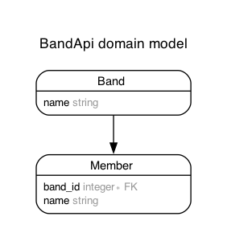

# Band API

# Features

# Model

Generated by Rails ERD. Run rails erd to regenerate (must have graphviz).

## Version

- ruby 3.2.2
- Rails 7.1.2

## References

- https://www.youtube.com/watch?v=3S9fyfmCf1A
- Rubocop:
  - https://sourcegraph.com/github.com/rails/rails/-/blob/.rubocop.yml
  - https://github.com/colinsoleim/react-on-rails-template/blob/main/.rubocop.yml
  - https://github.com/rails/rails/blob/main/.rubocop.yml
